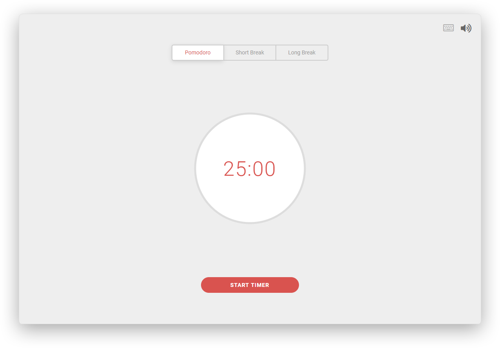

# [Pomodoro React](https://luizbatanero.github.io/pomodoro-react/)
Pomodoro timer built with React



## Features

* Keyboard Shortcuts
* HTML5 Notification
* Audio Notification (configurable)

## Running Locally

```sh
npm install
npm start
```

Runs the app in the development mode.<br>
Open [http://localhost:3000](http://localhost:3000) to view it in the browser.
